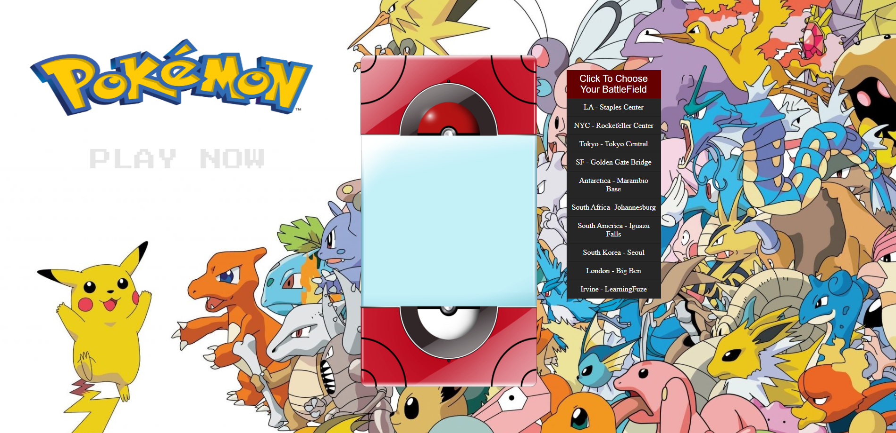

# Pokemon Hackathon

> - Maintained by: `James Dinh - jdinh8124`

> - Contributions by: ` Tim Lee - timothywlee, Andrew Lo - AndrewLo42
, and David Hong - dholic9  `

## Live
- Under construction

## Summary
- Pokemon Hackathon

## Languages Used
- JavaScript (ES5 & ES6)
- jQuery
- HTML5
- CSS3
- Pokemon Api
- Taco Api
- Weather api

## Features
- Users can battle pokemon in turn based fighting
- Users can choose stadium to battle pokemon
- Weather is affeced based on real life weather
- If the user wins they will receive a taco recipes

## Demo

